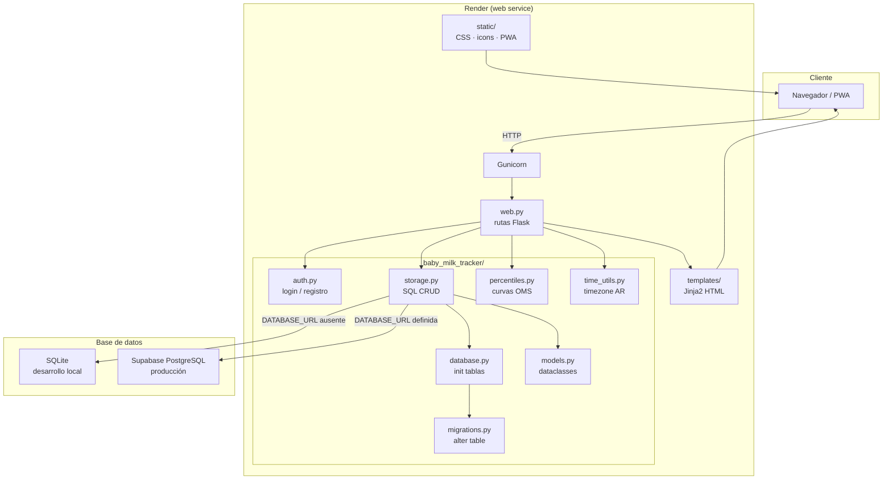

# Arquitectura — Baby Milk Tracker



## Flujo de una request típica

```
Navegador
   │  GET /
   ▼
Gunicorn → web.py (index route)
   │  get_user_settings(user_id)
   │  get_last_feeding(baby_id)
   │  get_last_growth_record(baby_id)
   │  get_next_appointment(baby_id)
   ▼
storage.py → SQL query
   ▼
SQLite (local) / PostgreSQL Supabase (producción)
   │
   ▼
web.py → render_template("index.html", ...)
   ▼
Navegador recibe HTML renderizado
```

## Estructura de la base de datos

```
users ──────────────┐
  id PK             │
  username          │ (user_id FK)
  password_hash     │
                    ▼
               babies
                 id PK
                 user_id FK
                 first_name
                 last_name
                 birth_date
                 sex
                    │
         ┌──────────┼──────────┬──────────────┬───────────────┐
         ▼          ▼          ▼              ▼               ▼
     feedings   pumpings  growth_records  appointments  medical_studies
     (baby_id)  (baby_id)   (baby_id)      (baby_id)     (baby_id)

                    │ (user_id FK)
                    ▼
              user_settings
              (show_pumpings)
```
